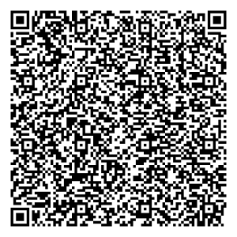

# ubirch-soap-proxy-go

Simple SOAP proxy for UBIRCH client requests.

```
(SOAP-Client) -> (Proxy/XML) -> (UBIRCH CLient/JSON)
```

### Configuration
A configuration file `config.json` is required and should be located in the working directory.
```json
{
  "verificationBaseURL": "https://SOMEDOMAIN.COM/verify",
  "ubirchClientURL": "http://localhost:8080"
}
```

### Request
- Protocol: `http`
- Address: `:8090`
- Headers:
    - `X-UUID`: `<UUID>`
    - `X-Auth-Token`: `<auth token>`
- Body: 
    ```xml
    <?xml version="1.0" encoding="utf-8"?>
    <soap:Envelope xmlns:soap='http://schemas.xmlsoap.org/soap/envelope/'>
      <soap:Body>
        <ubirch:Document xmlns:ubirch='http://ubirch.com/wsdl/1.0'>
          <ActionReferenceNumber>a</ActionReferenceNumber>
          <ActionID>1234567890</ActionID>
          <SpecialUseDesc>C32-cb12347-test</SpecialUseDesc>
          <PeriodBeginDate>2020-11-10</PeriodBeginDate>
          <PeriodBeginTime>11:30</PeriodBeginTime>
          <PeriodEndDate>2020-12-10</PeriodEndDate>
          <PeriodEndTime>12:35</PeriodEndTime>
          <PostCode>10997</PostCode>
          <City>Berlin</City>
          <District>Kreuzberg</District>
          <Street>Eisenbahnstr.</Street>
          <FromHouseNumber>42</FromHouseNumber>
          <ToHouseNumber>43</ToHouseNumber>
          <FromCrossroad>Muskauer Str.</FromCrossroad>
          <ToCrossroad>Wrangelstr.</ToCrossroad>
          <!-- optional -->
          <LicensePlate>B-PL 1234</LicensePlate>
          <!-- optional -->
          <GeoAreaCoordinates>52.5021851,13.4296059</GeoAreaCoordinates>
          <!-- optional -->
          <GeoOverviewCoordinates>52.5021851,13.4296059</GeoOverviewCoordinates>
        </ubirch:Document>
      </soap:Body>
    </soap:Envelope>
    ```
  
### Response
- On success:
  
  Status code: `200`
  
  Body:
  ```xml
  <?xml version="1.0" encoding="UTF-8"?>
  <soap:Envelope xmlns:soap="http://schemas.xmlsoap.org/soap/envelope/">
    <soap:Body>
        <ubirch:CertificationResponse xmlns:ubirch="http://ubirch.com/wsdl/1.0">
            <Hash>rnGP6u911NZakVgzYTrgQXkyqlGPhE+KVgXAYixhsOc=</Hash>
            <UPP>liPEEHkErEkhS0uZl3pDzlbAItvEQGYRAV0cfQv0I2UkzKzOb3j/qjBY+Addtbg//AdiHd1R5MuVCqM7jsAFLrZk4ESukICuT4XymZ74hhUmcw2AxwsAxCCucY/q73XU1lqRWDNhOuBBeTKqUY+ET4pWBcBiLGGw58RAlDqprKsmshw+dries4K7+56TVj4Z0VGBtWHTu3SkOcxCU2vxjivKilfysJZyV12kBdDpXdH2B3PYG33gaKqZKQ==</UPP>
            <Response>liPEEJ08eP8i80RBpdGFxjbUhv/EQJQ6qayrJrIcPna4nrOCu/uek1Y+GdFRgbVh07t0pDnMQlNr8Y4ryopX8rCWclddpAXQ6V3R9gdz2Bt94GiqmSkAxBCzFe3jXJZKRq01xxHklHqyxEgwRgIhAOHlY9A22Bx0Y9M8JVGize5GTSJ8QMv7ZkC3H5gee8oaAiEApUIzQaDumPveBgdI3fmgtl65kuVVlgrRy3whWBRl42k=</Response>
            <URL>https://ubirch.com/gelsenkirchen#GeoOverviewCoordinates=52.5021851,13.4296059;SpecialUseDesc=C32-cb12347-test;PostCode=10997;City=Berlin;FromHouseNumber=42;FromCrossroad=Muskauer%20Str.;LicensePlate=B-PL%201234;PeriodEndDate=2020-12-11;PeriodBeginDate=2020-11-09;District=Kreuzberg;Street=Eisenbahnstr.;ToHouseNumber=43;ActionID=1234567890;PeriodBeginTime=11:30;PeriodEndTime=12:35;ToCrossroad=Wrangelstr.;GeoAreaCoordinates=52.5021851,13.4296059;ActionReferenceNumber=a</URL>
        </ubirch:CertificationResponse>
    </soap:Body>
  </soap:Envelope>
  ```
  
- On fail:

  Status code: `>= 300`

  Body:
  ```xml
  <soap:Fault>
      <faultcode>soap:Server</faultcode>
      <faultstring>error message</faultstring>
  </soap:Fault>
  ```

# Example

Run both the [ubirch-client-go](https://github.com/ubirch/ubirch-client-go)
and this proxy. Make sure the `ubirchClientURL`above is correct.

## Sending Requests

The SOAP client must send authentication headers with the POST request:

```
X-UUID: xxxxxxxx-xxxx-xxxx-xxxx-xxxxxxxxxxxx
X-Auth-Token: xxxx
```

An example [request](example_request.xml) and [response](example_response.xml) are provided.
The response contains a URL that is then to be rendered into a QR code. Below is the
URL from the example response:



## Copyright

```
Copyright (c) 2020 ubirch GmbH

Licensed under the Apache License, Version 2.0 (the "License");
you may not use this file except in compliance with the License.
You may obtain a copy of the License at

    http://www.apache.org/licenses/LICENSE-2.0

Unless required by applicable law or agreed to in writing, software
distributed under the License is distributed on an "AS IS" BASIS,
WITHOUT WARRANTIES OR CONDITIONS OF ANY KIND, either express or implied.
See the License for the specific language governing permissions and
limitations under the License.
```
