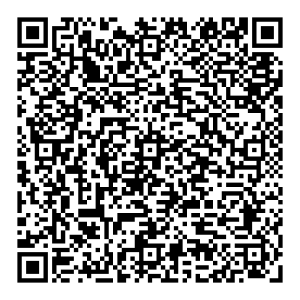

# ubirch-soap-proxy-go

Simple SOAP proxy for UBIRCH client requests.

```
(SOAP-Client) -> (Proxy/XML) -> (UBIRCH CLient/JSON)
```

### Configuration
A configuration file `config.json` is required and should be located in the working directory.
```json
{
  "verificationBaseURL": "https://SOMEDOMAIN.COM/verify",
  "ubirchClientURL": "http://localhost:8080"
}
```

### Request
- Protocol: `http`
- Address: `:8090`
- Headers:
    - `X-UUID`: `<UUID>`
    - `X-Auth-Token`: `<auth token>`
- Body: 
    ```xml
    <?xml version="1.0" encoding="utf-8"?>
    <soap:Envelope xmlns:soap='http://schemas.xmlsoap.org/soap/envelope/'>
        <soap:Body>
            <ubirch:Document xmlns:ubirch='http://ubirch.com/wsdl/1.0'>
                <!-- optional -->
                <ActionReferenceNumber>?XXX?</ActionReferenceNumber>
                <!-- optional -->
                <ActionID>?XXX?</ActionID>
                <!-- optional -->
                <SpecialUseID>?XXX?</SpecialUseID>
                <!-- optional -->
                <PeriodBeginDate>?XXX?</PeriodBeginDate>
                <!-- optional -->
                <PeriodBeginTime>?XXX?</PeriodBeginTime>
                <!-- optional -->
                <PeriodEndDate>?XXX?</PeriodEndDate>
                <!-- optional -->
                <PeriodEndTime>?XXX?</PeriodEndTime>
                <!-- optional -->
                <PostCode>?XXX?</PostCode>
                <!-- optional -->
                <City>?XXX?</City>
                <!-- optional -->
                <District>?XXX?</District>
                <!-- optional -->
                <Street>?XXX?</Street>
                <!-- optional -->
                <HouseNumber>?XXX?</HouseNumber>
                <!-- optional -->
                <FromCrossroad>?XXX?</FromCrossroad>
                <!-- optional -->
                <ToCrossroad>?XXX?</ToCrossroad>
                <!-- optional -->
                <LicensePlate>?XXX?</LicensePlate>
                <!-- optional -->
                <GeoAreaCoordinates>?XXX?</GeoAreaCoordinates>
                <!-- optional -->
                <GeoOverviewCoordinates>?XXX?</GeoOverviewCoordinates>
            </ubirch:Document>
        </soap:Body>
    </soap:Envelope>
    ```
  
### Response
- On success:
  
  Status code: `200`
  
  Body:
  ```xml
  <CertificationResponse>
      <Hash>DtHDmmjNhEBo2hRtaC6gf2rDNIY79KZl1pVRYwNoOk8=</Hash>
      <Upp>liPEEN8YOMYeDkkYiMkbAAAmJZrEQH0GtjA55S0jh+7u1737r0sKhfFW/BafY1QXgLAoGTl0buqu4rivbLNEOaxg+EnqFXCIa3mktOIcwCF3mcZQheMAxCAO0cOaaM2EQGjaFG1oLqB/asM0hjv0pmXWlVFjA2g6T8RAcdSwMgBT26c7jIaw34KoFbkleRfKw/wx+2NLjdL1acBBGgJ6L5ldt9CMfPtuvNfEsrK2R6GJD5ukuYHHLK0pJA==</Upp>
      <Response>liPEEJ08eP8i80RBpdGFxjbUhv/EQHHUsDIAU9unO4yGsN+CqBW5JXkXysP8MftjS43S9WnAQRoCei+ZXbfQjHz7brzXxLKytkehiQ+bpLmBxyytKSQAxBDrcgnN3+VHabEJ5zsfCTUUxEcwRQIgDOiLpZzX4vgtFCBZXl6wcF+pJA0OSkSH7fSNnODssMQCIQDqH5s8Hf65YjM/nX8881Ralx+gfPD43uGWtofJe7zTuQ==</Response>
      <VerificationURL>https://SOMEDOMAIN.COM/verify#FromCrossroad:m;ToCrossroad:n;LicensePlate:o;ActionID:b;PeriodBeginDate:d;PeriodBeginTime:e;PeriodEndDate:f;District:j;Street:k;ActionReferenceNumber:a;SpecialUseID:c;PeriodEndTime:g;HouseNumber:l;GeoAreaCoordinates:p;GeoOverviewCoordinates:q;PostCode:h;City:i</VerificationURL>
  </CertificationResponse>
  ```
  
- On fail:

  Status code: `>= 300`

  Body:
  ```xml
  <fault>
      <faultcode>soap:Server</faultcode>
      <faultstring>error message</faultstring>
  </fault>
  ```

# Example

Run both the [ubirch-client-go](https://github.com/ubirch/ubirch-client-go)
and this proxy. Make sure the `ubirchClientURL`above is correct.

## Sending Requests

The SOAP client must send authentication headers with the POST request:

```
X-UUID: xxxxxxxx-xxxx-xxxx-xxxx-xxxxxxxxxxxx
X-Auth-Token: xxxx
```

An example [request](example_request.xml) and [response](example_response.xml) are provided.
The response contains a URL that is then to be rendered into a QR code. Below is the
URL from the example response:



